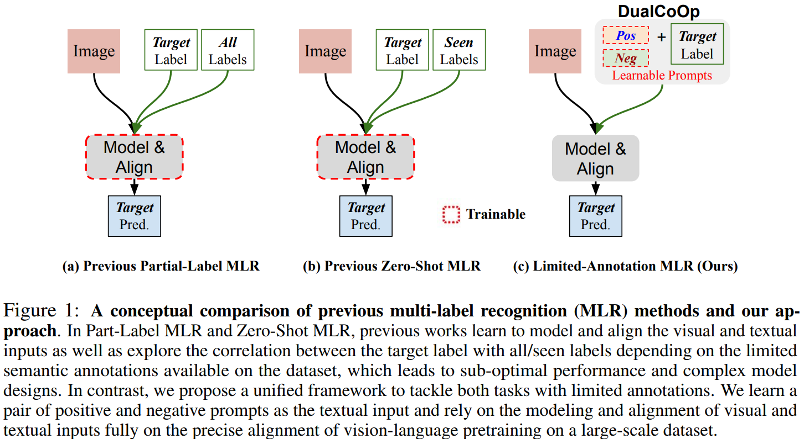
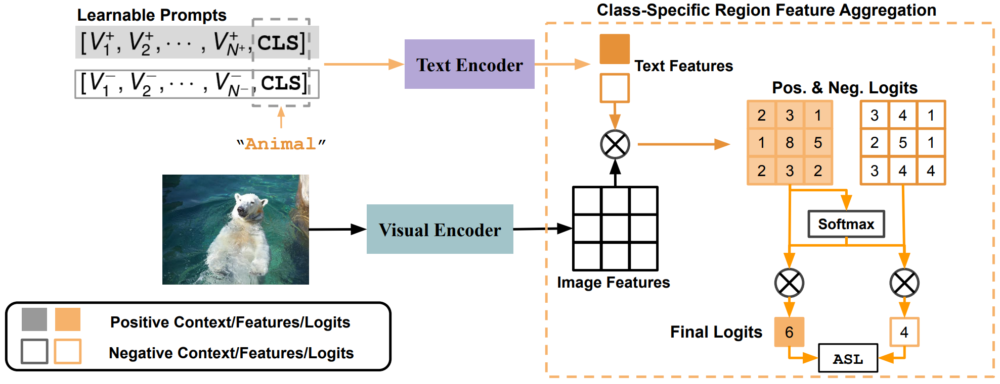
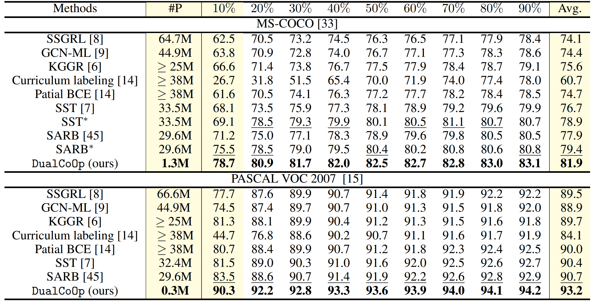

# DualCoop
 Reproduce PyTorch implementation of the paper "DualCoOp: Fast Adaptation to Multi-Label Recognition with Limited Annotations" NIPS 2022


## Abstract
Solving multi-label recognition (MLR) for images in the low-label regime is a challenging task with many real-world applications. Recent work learns an alignment between textual and visual spaces to compensate for insufficient image labels, but loses accuracy because of the limited amount of available MLR annotations. In this work, we utilize the strong alignment of textual and visual features pretrained with millions of auxiliary image-text pairs and propose Dual Context Optimization (DualCoOp) as a unified framework for partial-label MLR and zero-shot MLR. DualCoOp encodes positive and negative contexts with class names as part of the linguistic input (i.e. prompts). Since DualCoOp only introduces a very light learnable overhead upon the pretrained vision-language framework, it can quickly adapt to multi-label recognition tasks that have limited annotations and even unseen classes. Experiments on standard multi-label recognition benchmarks across two challenging low-label settings demonstrate the advantages of our approach over state-of-the-art methods.


## Motivation



## Architecture
Illustration of our proposed approach. DualCoOp learns a pair of positive and negative prompts to quickly adapt powerful pretrained vision-text encoders to the MLR task. For each class, two prompts generate two contrastive (positive and negative) textual embeddings as the input to the text encoder. Furthermore, we propose Class-Specific Region Feature Aggregation to first project each region’s feature to the textual space and then aggregate the spatial logits by the magnitude of class-specific semantic responses. During training, we apply the ASL loss to optimize learnable prompts while keeping other network components frozen. During inference, we compare the positive and negative logits to make a prediction for each class.


## Experiments



## Citation
- If you find this work is helpful, please cite the paper
```
@inproceedings{
    sun2022dualcoop,
    title={DualCoOp: Fast Adaptation to Multi-Label Recognition with Limited Annotations},
    author={Ximeng Sun and Ping Hu and Kate Saenko},
    booktitle={Advances in Neural Information Processing Systems},
    editor={Alice H. Oh and Alekh Agarwal and Danielle Belgrave and Kyunghyun Cho},
    year={2022},
    url={https://openreview.net/forum?id=QnajmHkhegH}
}
```

